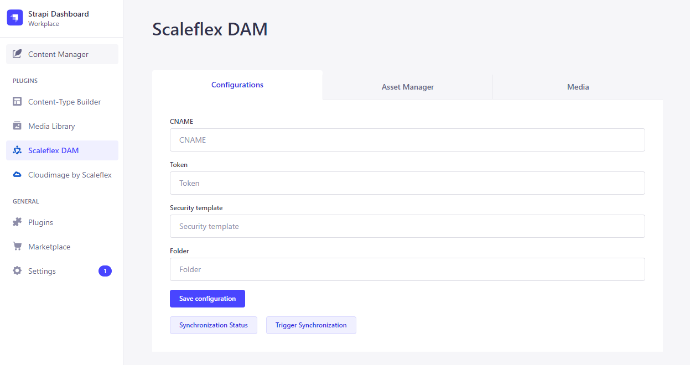
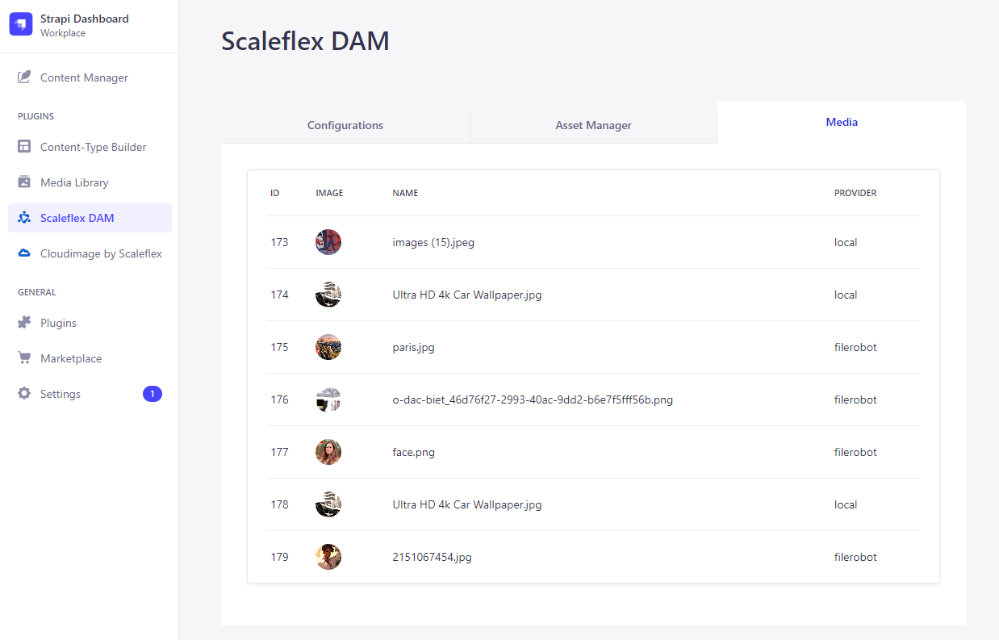
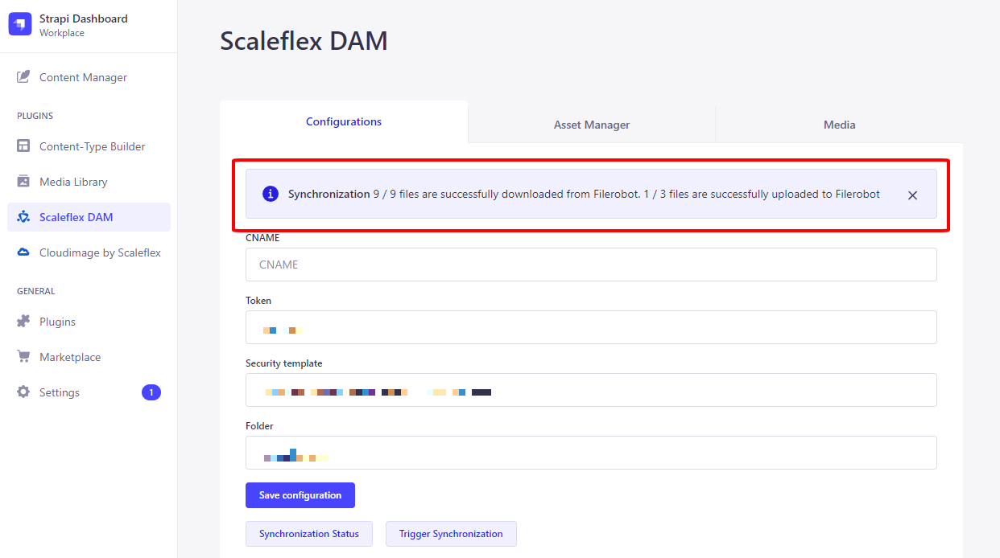
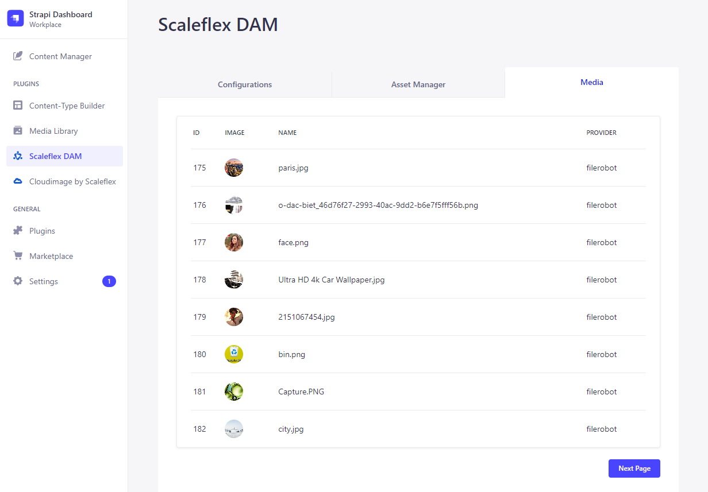
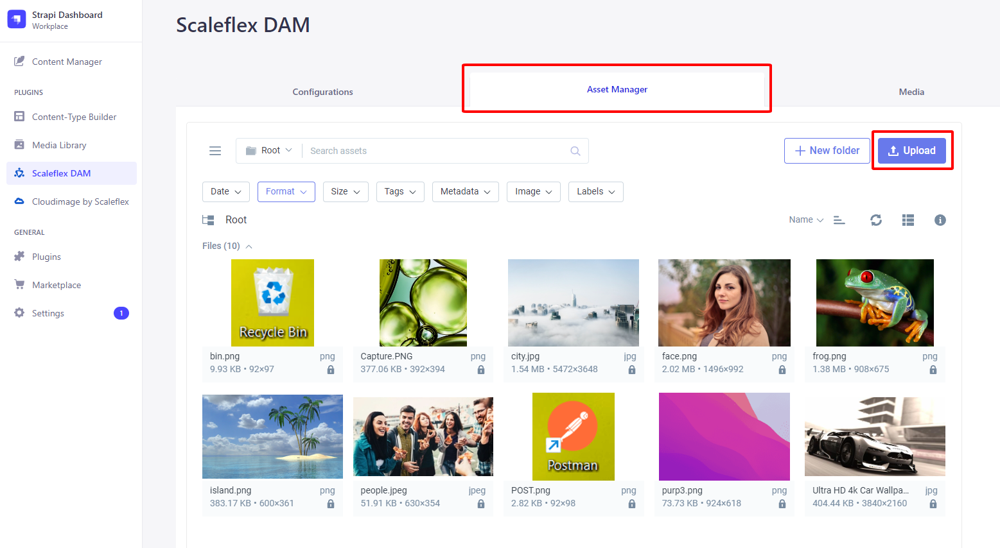
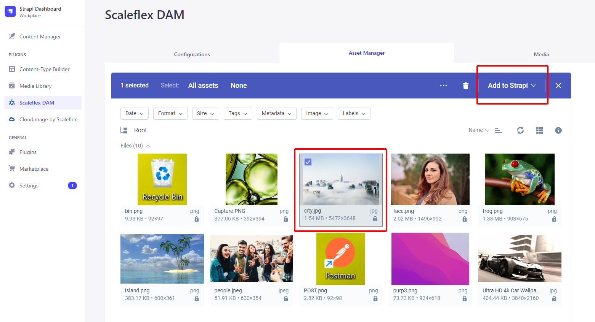

# Scaleflex DAM plugin for Strapi v5

## Intro

Strapi v5.x.x

To know which versions of Node goes with which versions of Strapi, refer to here: https://github.com/strapi/strapi/releases

If you are not familiar with using the Strapi CMS, here are some quick tutorials:

Strapi v4: https://docs.strapi.io/developer-docs/latest/getting-started/quick-start.html

## Install Strapi CMS

You can run, for example: `npx create-strapi-app@5.33.0`

## Plugin

https://www.npmjs.com/package/@filerobot-strapi/content-plugin

At this point, assuming that you already have a Strapi CMS installed and set up, and that you already have a super-admin user configured. It's time to install the Scaleflex DAM plugin for Strapi v4:

`npm install @filerobot-strapi/content-plugin`

(Use `npm install @filerobot-strapi/content-plugin --legacy-peer-deps` if you need to)

## Run

`yarn build`

`yarn start`

## Configure

Click "Scaleflex DAM" on the left vertical menu (under the plugins section)



- **CNAME** should be without `https://`
- **Folder** can have a preceding `/` , but it's not necessary. So both `/folder_name` and `folder_name` are ok

## Usage

Now you can make use of the "Synchronization Status" and "Trigger Synchronization" buttons.

### Media Tab



The **Media Tab** keeps a "log" of all your media assets.

Indeed, there are 3 local images that are yet to be synchronized to the **Scaleflex DAM**.

And there are indeed 4 remote images on the **Scaleflex DAM** that are yet to be synchronized down to the Strapi CMS.

### Trigger Synchronization



Afterwards, the logs will be updated:



## FMAW Tab

When you **Upload**, the image will be uploaded to the **Scaleflex DAM**. Also, the same image (with **Scaleflex DAM** URL) will go into the Strapi CMS:



If you know that `city.jpg` only exists on the **Scaleflex DAM** (ie: haven't yet been synchronized down to the Strapi CMS), then you can check it and press "**Add to Strapi**":



## REST API

**Give the appropriate permissions to the authenticated user**


**Get the auth token**

https://www.youtube.com/watch?v=TIK9CYDgs5k&list=PL2dKqfImstaROBMu304aaEfIVTGodkdHh&index=3 (even though this tutorial is for Strapi v3, it's still applicable to Strapi v4)

```
curl --location --request POST '{domain}/api/auth/local' 
--form 'identifier="{an authenticated user's email}"' \
--form 'password="{an authenticated user's password'}"'
```

**Retrieve Media**

https://docs.strapi.io/developer-docs/latest/plugins/upload.html#endpoints

GET all media

```
curl --location --request GET '{domain}/api/upload/files' \
--header 'Authorization: Bearer {token}'
```

GET one media

```
curl --location --request GET '{domain}/api/upload/files/3' \
--header 'Authorization: Bearer {token}'
```

**Retrieve custom content-types**

https://docs.strapi.io/developer-docs/latest/developer-resources/database-apis-reference/rest-api.html

GET collection-type contents

```
curl --location --request GET '{domain}/api/tests' \
--header 'Authorization: Bearer {token}'
```

GET one collection-type content

```
curl --location --request GET '{domain}/api/tests/1' \
--header 'Authorization: Bearer {token}'
```

Note: If your content-type contains Media fields, then you have to append this query parameter for media info to show `?populate=%2A`

https://docs.strapi.io/developer-docs/latest/developer-resources/database-apis-reference/rest/populating-fields.html#population

